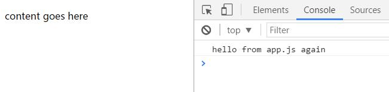
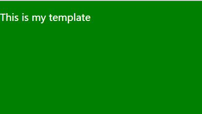
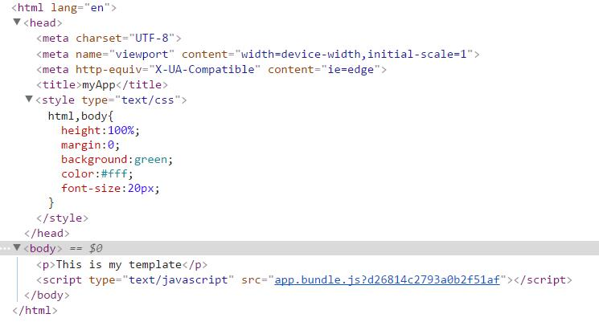

# webpack-starter
### 1、项目初始化
``` bash
npm init
```
一路回车即可！最终会生成package.json文件，如下所示：
``` json
{
  "name": "webpack-starter",
  "version": "1.0.0",
  "description": "``` bash\r npm init\r ```\r 一路回车即可！最终会生成package.json文件，如下所示：\r ``` json",
  "main": "index.js",
  "scripts": {
    "test": "echo \"Error: no test specified\" && exit 1"
  },
  "repository": {
    "type": "git",
    "url": "git+https://github.com/swimly/webpack-starter.git"
  },
  "author": "",
  "license": "ISC",
  "bugs": {
    "url": "https://github.com/swimly/webpack-starter/issues"
  },
  "homepage": "https://github.com/swimly/webpack-starter#readme"
}
```
接下来全局安装webpack。
``` bash
npm i -g webpack  // 已安装的跳过
```
在该项目安装webpack
``` bash
npm i -D webpack
```
package.json:
``` json
"devDependencies": {
  "webpack": "^2.3.2"
}
```
创建如下目录结构：
```
+ src
  - app.js
+ dist
package.json
```
app.js
``` javascript
console.log('hello from app.js')
```
到此就可以用webpack进行简单的打包
``` bash
webpack ./src/app.js ./dist/app.bundle.js
```
``` bash
webpack ./src/app.js ./dist/app.bundle.js
Hash: 59e49fa6a143615fafca
Version: webpack 2.3.2
Time: 64ms
        Asset     Size  Chunks             Chunk Names
app.bundle.js  2.66 kB       0  [emitted]  main
   [0] ./src/app.js 32 bytes {0} [built]
```
``` bash
webpack ./src/app.js ./dist/app.bundle.js -p //打包出来的文件被压缩处理
```
``` bash
webpack ./src/app.js ./dist/app.bundle.js -p --watch //打包出来的文件被压缩处理,并且实时监听文件的变化
```
这时候就可以看到dist目录下会生成一个app.bundle.js文件，呃，如果每次都这样打包，那这样还有什么乐趣可言。

接下来在根目录创建webpack.config.js
``` javascript
module.exports = {
  entry: './src/app.js',
  output: {
    filename: './dist/app.bundle.js'
  }
}
```
接下来在终端输入：
``` bash
webpack
```
就这么简单就可以进行项目打包。
修改package.json文件如下所示：
``` json
"scripts": {
  "test": "echo \"Error: no test specified\" && exit 1",
  "dev": "webpack -d --watch"  //这条是添加的
}
```
这时候我们只用在终端输入
``` bash
npm run dev
```
就可以实时监听项目并且打包了！
当然开发时候是这样，实际项目打包我们还需要如下：
``` json
"scripts": {
  "test": "echo \"Error: no test specified\" && exit 1",
  "dev": "webpack -d --watch",
  "prod": "webpack -p"
},
```
### 2、webpack plugins
在dist目录中创建 index.html，并且引入打包好的js文件
``` html
<!DOCTYPE html>
<html lang="en">
<head>
  <meta charset="UTF-8">
  <meta name="viewport" content="width=device-width, initial-scale=1.0">
  <meta http-equiv="X-UA-Compatible" content="ie=edge">
  <title>Document</title>
</head>
<body>
  <p>content goes here</p>
  <script src="./app.bundle.js"></script>
</body>
</html>
```
不出意外就会看到如下的页面！



当然，如果我们不想自己手动去在dist目录创建html文件，这时候就可以利用webpack的plugin来帮我们创建。
``` bash
npm i html-webpack-plugin --save-dev
```
修改webpack.config.js如下所示，并且删除dist目录的index.html.
``` javascript
var HtmlWebpackPlugin = require('html-webpack-plugin');
var path = require('path')
module.exports = {
  entry: './src/app.js',
  output: {
    path: path.resolve(__dirname, 'dist'),
    filename: 'app.bundle.js'
  },
  plugins: [new HtmlWebpackPlugin()]
}
```
然后再次运行
``` bash
npm run dev
```
这时候你会看到dist目录里面已经自动生成一个index.html文件
``` html
<!DOCTYPE html>
<html>
  <head>
    <meta charset="UTF-8">
    <title>Webpack App</title>
  </head>
  <body>
  <script type="text/javascript" src="app.bundle.js"></script></body>
</html>
```
如果我们想要根据自己的模板来创建html呢，修改webpack.config.js如下所示：
``` javascript
var HtmlWebpackPlugin = require('html-webpack-plugin');
var path = require('path')
module.exports = {
  entry: './src/app.js',
  output: {
    path: path.resolve(__dirname, 'dist'),
    filename: 'app.bundle.js'
  },
  plugins: [
    new HtmlWebpackPlugin({
      title: 'myApp',
      minify: {
        collapseWhitespace: true //生成被压缩的html文件
      },
      hash: true,
      template: './src/index.html', // Load a custom template (ejs by default see the FAQ for details)
    })
  ]
}
```
在src目录添加index.html
``` html
<!DOCTYPE html>
<html lang="en">
<head>
  <meta charset="UTF-8">
  <meta name="viewport" content="width=device-width, initial-scale=1.0">
  <meta http-equiv="X-UA-Compatible" content="ie=edge">
  <title><%= htmlWebpackPlugin.options.title %></title>
</head>
<body>
  <p>This is my template</p>
</body>
</html>
```
这时候再次打包，会根据我们创建的模板来生成html文件。
### 3、css-loader、sass-loader为项目添砖加瓦。
#### css-loader
``` bash
npm install css-loader style-loader --save-dev
```
在src目录新建app.css
``` css
html,body{
  height:100%;
  margin:0;
  background:green;
  color:#fff;
  font-size:20px;
}
```
修改webpack.config.js添加如下
``` javascript
module: {
    rules: [
      {test: /\.css$/, loaders: 'style-loader!css-loader'}
      // {test: /\.css$/, use: ['style-loader', 'css-loader']}
    ]
  },
```
修改app.js
``` javascript
import './app.css'
console.log('hello from app.js again')
```
#### sass-loader
``` bash
npm install --save-dev sass-loader node-sass
```
修改webpack.config.js
``` javascript
module: {
    rules: [
      {test: /\.css$/, use: ['style-loader', 'css-loader']},
      {test: /\.scss$/, use: ['style-loader', 'css-loader', 'sass-loader']}
    ]
  },
```
修改app.js
``` javascript
import './main.scss'
console.log('hello from app.js again')
```
在src目录新建main.scss
``` scss
body{background:#ff0;}
```


从上图我们可以看出，这样打包的样式最终都是直接加在页面的head里面，但是我们如果想以文件的方式引入进去又该如何？

``` bash
npm install --save-dev extract-text-webpack-plugin
```
修改webpack.config.js
``` javascript
var HtmlWebpackPlugin = require('html-webpack-plugin');
const ExtractTextPlugin = require("extract-text-webpack-plugin");
var path = require('path')

module.exports = {
  entry: './src/app.js',
  output: {
    path: path.resolve(__dirname, 'dist'),
    filename: 'app.bundle.js'
  },
  module: {
    rules: [
      {test: /\.css$/, use: ExtractTextPlugin.extract({
        fallback: 'style-loader',
        use: ['css-loader']
      })},
      {test: /\.scss$/, use: ExtractTextPlugin.extract({
        fallback: 'style-loader',
        use: ['css-loader', 'sass-loader']
      })}
    ]
  },
  plugins: [
    new ExtractTextPlugin({
      filename:  (getPath) => {
        return getPath('css/[name].css').replace('css/js', 'css');
      },
      allChunks: true
    }),
    new HtmlWebpackPlugin({
      title: 'myApp',
      minify: {
        collapseWhitespace: true //生成被压缩的html文件
      },
      hash: true,
      template: './src/index.html', // Load a custom template (ejs by default see the FAQ for details)
    })
  ]
}
```
详情请参考：[https://www.npmjs.com/package/extract-text-webpack-plugin](https://www.npmjs.com/package/extract-text-webpack-plugin)