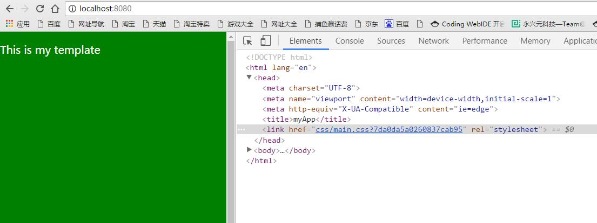
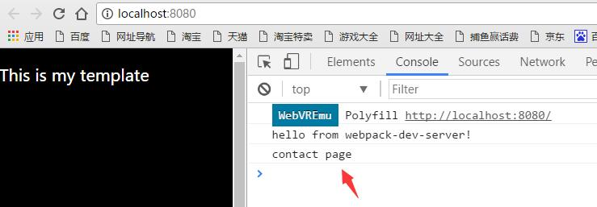
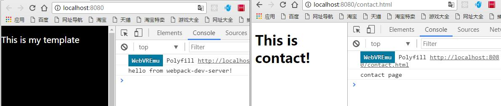
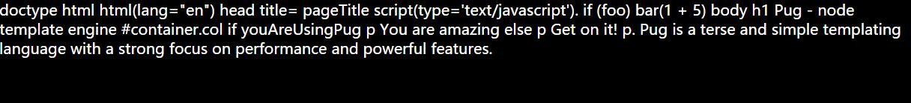
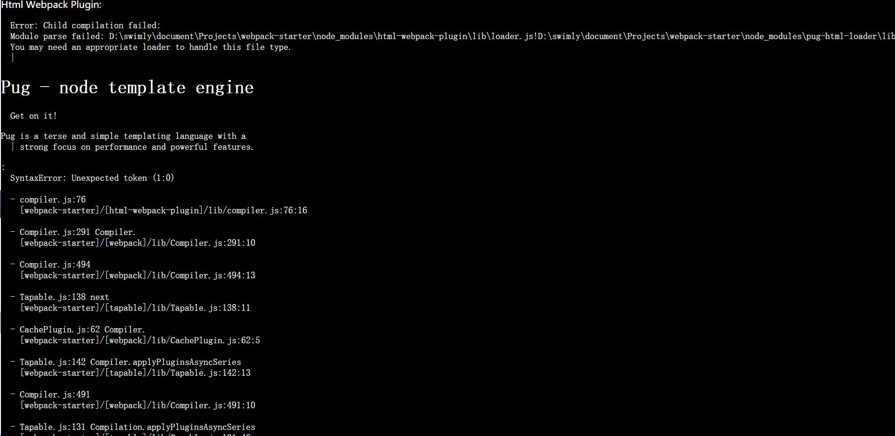
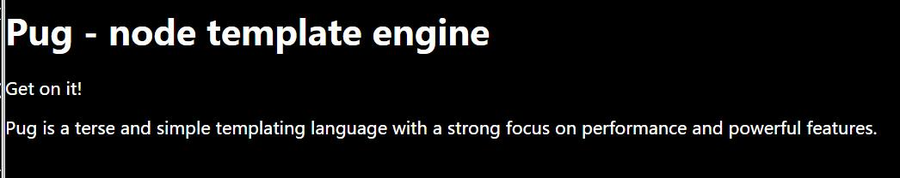
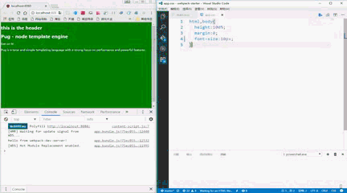
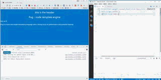

# webpack-starter
#### 1、项目初始化
``` bash
npm init
```
一路回车即可！最终会生成package.json文件，如下所示：
``` json
{
  "name": "webpack-starter",
  "version": "1.0.0",
  "description": "``` bash\r npm init\r ```\r 一路回车即可！最终会生成package.json文件，如下所示：\r ``` json",
  "main": "index.js",
  "scripts": {
    "test": "echo \"Error: no test specified\" && exit 1"
  },
  "repository": {
    "type": "git",
    "url": "git+https://github.com/swimly/webpack-starter.git"
  },
  "author": "",
  "license": "ISC",
  "bugs": {
    "url": "https://github.com/swimly/webpack-starter/issues"
  },
  "homepage": "https://github.com/swimly/webpack-starter#readme"
}
```
接下来全局安装webpack。
``` bash
npm i -g webpack  // 已安装的跳过
```
在该项目安装webpack
``` bash
npm i -D webpack
```
package.json:
``` json
"devDependencies": {
  "webpack": "^2.3.2"
}
```
创建如下目录结构：
```
+ src
  - app.js
+ dist
package.json
```
app.js
``` javascript
console.log('hello from app.js')
```
到此就可以用webpack进行简单的打包
``` bash
webpack ./src/app.js ./dist/app.bundle.js
```
``` bash
webpack ./src/app.js ./dist/app.bundle.js
Hash: 59e49fa6a143615fafca
Version: webpack 2.3.2
Time: 64ms
        Asset     Size  Chunks             Chunk Names
app.bundle.js  2.66 kB       0  [emitted]  main
   [0] ./src/app.js 32 bytes {0} [built]
```
``` bash
webpack ./src/app.js ./dist/app.bundle.js -p //打包出来的文件被压缩处理
```
``` bash
webpack ./src/app.js ./dist/app.bundle.js -p --watch //打包出来的文件被压缩处理,并且实时监听文件的变化
```
这时候就可以看到dist目录下会生成一个app.bundle.js文件，呃，如果每次都这样打包，那这样还有什么乐趣可言。

接下来在根目录创建webpack.config.js
``` javascript
module.exports = {
  entry: './src/app.js',
  output: {
    filename: './dist/app.bundle.js'
  }
}
```
接下来在终端输入：
``` bash
webpack
```
就这么简单就可以进行项目打包。
修改package.json文件如下所示：
``` json
"scripts": {
  "test": "echo \"Error: no test specified\" && exit 1",
  "dev": "webpack -d --watch"  //这条是添加的
}
```
这时候我们只用在终端输入
``` bash
npm run dev
```
就可以实时监听项目并且打包了！
当然开发时候是这样，实际项目打包我们还需要如下：
``` json
"scripts": {
  "test": "echo \"Error: no test specified\" && exit 1",
  "dev": "webpack -d --watch",
  "prod": "webpack -p"
},
```
#### 2、webpack plugins
在dist目录中创建 index.html，并且引入打包好的js文件
``` html
<!DOCTYPE html>
<html lang="en">
<head>
  <meta charset="UTF-8">
  <meta name="viewport" content="width=device-width, initial-scale=1.0">
  <meta http-equiv="X-UA-Compatible" content="ie=edge">
  <title>Document</title>
</head>
<body>
  <p>content goes here</p>
  <script src="./app.bundle.js"></script>
</body>
</html>
```
不出意外就会看到如下的页面！


当然，如果我们不想自己手动去在dist目录创建html文件，这时候就可以利用webpack的plugin来帮我们创建。
``` bash
npm i html-webpack-plugin --save-dev
```
修改webpack.config.js如下所示，并且删除dist目录的index.html.
``` javascript
var HtmlWebpackPlugin = require('html-webpack-plugin');
var path = require('path')
module.exports = {
  entry: './src/app.js',
  output: {
    path: path.resolve(__dirname, 'dist'),
    filename: 'app.bundle.js'
  },
  plugins: [new HtmlWebpackPlugin()]
}
```
然后再次运行
``` bash
npm run dev
```
这时候你会看到dist目录里面已经自动生成一个index.html文件
``` html
<!DOCTYPE html>
<html>
  <head>
    <meta charset="UTF-8">
    <title>Webpack App</title>
  </head>
  <body>
  <script type="text/javascript" src="app.bundle.js"></script></body>
</html>
```
如果我们想要根据自己的模板来创建html呢，修改webpack.config.js如下所示：
``` javascript
var HtmlWebpackPlugin = require('html-webpack-plugin');
var path = require('path')
module.exports = {
  entry: './src/app.js',
  output: {
    path: path.resolve(__dirname, 'dist'),
    filename: 'app.bundle.js'
  },
  plugins: [
    new HtmlWebpackPlugin({
      title: 'myApp',
      minify: {
        collapseWhitespace: true //生成被压缩的html文件
      },
      hash: true,
      template: './src/index.html', // Load a custom template (ejs by default see the FAQ for details)
    })
  ]
}
```
在src目录添加index.html
``` html
<!DOCTYPE html>
<html lang="en">
<head>
  <meta charset="UTF-8">
  <meta name="viewport" content="width=device-width, initial-scale=1.0">
  <meta http-equiv="X-UA-Compatible" content="ie=edge">
  <title><%= htmlWebpackPlugin.options.title %></title>
</head>
<body>
  <p>This is my template</p>
</body>
</html>
```
这时候再次打包，会根据我们创建的模板来生成html文件。
#### 3、css-loader、sass-loader为项目添砖加瓦。
##### css-loader
``` bash
npm install css-loader style-loader --save-dev
```
在src目录新建app.css
``` css
html,body{
  height:100%;
  margin:0;
  background:green;
  color:#fff;
  font-size:20px;
}
```
修改webpack.config.js添加如下
``` javascript
module: {
    rules: [
      {test: /\.css$/, loaders: 'style-loader!css-loader'}
      // {test: /\.css$/, use: ['style-loader', 'css-loader']}
    ]
  },
```
修改app.js
``` javascript
import './app.css'
console.log('hello from app.js again')
```
##### sass-loader
``` bash
npm install --save-dev sass-loader node-sass
```
修改webpack.config.js
``` javascript
module: {
    rules: [
      {test: /\.css$/, use: ['style-loader', 'css-loader']},
      {test: /\.scss$/, use: ['style-loader', 'css-loader', 'sass-loader']}
    ]
  },
```
修改app.js
``` javascript
import './main.scss'
console.log('hello from app.js again')
```
在src目录新建main.scss
``` scss
body{background:#ff0;}
```


从上图我们可以看出，这样打包的样式最终都是直接加在页面的head里面，但是我们如果想以文件的方式引入进去又该如何？

``` bash
npm install --save-dev extract-text-webpack-plugin
```
修改webpack.config.js
``` javascript
var HtmlWebpackPlugin = require('html-webpack-plugin');
const ExtractTextPlugin = require("extract-text-webpack-plugin");
var path = require('path')

module.exports = {
  entry: './src/app.js',
  output: {
    path: path.resolve(__dirname, 'dist'),
    filename: 'app.bundle.js'
  },
  module: {
    rules: [
      {test: /\.css$/, use: ExtractTextPlugin.extract({
        fallback: 'style-loader',
        use: ['css-loader']
      })},
      {test: /\.scss$/, use: ExtractTextPlugin.extract({
        fallback: 'style-loader',
        use: ['css-loader', 'sass-loader']
      })}
    ]
  },
  plugins: [
    new ExtractTextPlugin({
      filename:  (getPath) => {
        return getPath('css/[name].css').replace('css/js', 'css');
      },
      allChunks: true
    }),
    new HtmlWebpackPlugin({
      title: 'myApp',
      minify: {
        collapseWhitespace: true //生成被压缩的html文件
      },
      hash: true,
      template: './src/index.html', // Load a custom template (ejs by default see the FAQ for details)
    })
  ]
}
```
详情请参考：[https://www.npmjs.com/package/extract-text-webpack-plugin](https://www.npmjs.com/package/extract-text-webpack-plugin)
#### 4、webpack-dev-server
``` bash
npm i webpack-dev-server -D
```
修改package.json如下：
``` json
"scripts": {
  "test": "echo \"Error: no test specified\" && exit 1",
  "dev": "webpack-dev-server", // 这里是刚修改的
  "prod": "webpack -p"
},
```
然后
``` bash
npm run dev
```
就可以启动这个服务器了！

修改webpack.config.js，添加如下
``` javascript
devServer: {
  contentBase: path.join(__dirname, 'dist'),
  compress: true,
  port: 8080,
  stats: 'errors-only',
  open: true // 启动后自动打开浏览器窗口
},
```
#### 5、多模块的使用
rimraf清理项目
``` bash
npm i -D rimraf
```
package.json修改如下：
``` json
"scripts": {
  "test": "echo \"Error: no test specified\" && exit 1",
  "dev": "webpack-dev-server",
  "prod": "npm run clean && webpack -p",
  "clean": "rimraf ./dist/*"
}
```
这样的话会在每次打包的时候将dist目录清空，然后重新生成，以确保dist目录没有多余的无用文件。
一般情况一个项目肯定不止一个页面吧，解析来创建contact模块，修改webpack.config.js,在plugins中添加：
``` javascript
new HtmlWebpackPlugin({
  title: 'contact',
  hash: true,
  filename: 'contact.html',
  template: './src/contact.html'
})
```
并且在src根目录创建一个新的hmtl模板contact.html
``` html
<!DOCTYPE html>
<html lang="en">
<head>
  <meta charset="UTF-8">
  <meta name="viewport" content="width=device-width, initial-scale=1.0">
  <meta http-equiv="X-UA-Compatible" content="ie=edge">
  <title><%= htmlWebpackPlugin.options.title %></title>
</head>
<body>
  <p>This is contact!</p>
</body>
</html>
```
在src根目录新增contact.js
``` javascript
console.log('contact page')
```
由于有多个入口文件，修改webpack.config.js的entry和output
``` javascript
entry: {
  app: './src/app.js',
  contact: './src/contact.js'
},
output: {
  path: path.resolve(__dirname, 'dist'),
  filename: '[name].bundle.js'
},
```

这时候再次启动服务器，我们会发现，在index中contact.js也被调用了，这可不是我们想要的，我们只想contact.js在contact页面中被调用，修改webpack.config.js

``` javascript
new HtmlWebpackPlugin({
  title: 'myApp',
  hash: true,
  filename: './index.html',
  excludeChunks: ['contact'], //新增
  template: './src/index.html',
}),
new HtmlWebpackPlugin({
  title: 'contact',
  hash: true,
  filename: 'contact.html',
  chunks: ['contact'], //新增
  template: './src/contact.html'
})
```

这样一来，我们两个模块就互不干扰了！

#### 6、use pug
自动生成html文件可以用html作为模板，除此之外我们还可以写jade语法，这个就需要利用pug了。
我们把src/index.html改成index.pug

``` pug
doctype html
html(lang="en")
  head
    title= pageTitle
    script(type='text/javascript').
      if (foo) bar(1 + 5)
  body
    h1 Pug - node template engine
    #container.col
      if youAreUsingPug
        p You are amazing
      else
        p Get on it!
      p.
        Pug is a terse and simple templating language with a
        strong focus on performance and powerful features.
```
webpack.config.js
``` javascript
new HtmlWebpackPlugin({
  title: 'myApp',
  // minify: {
  //   collapseWhitespace: true //生成被压缩的html文件
  // },
  hash: true,
  filename: './index.html',
  excludeChunks: ['contact'],
  template: './src/index.pug', // Load a custom template (ejs by default see the FAQ for details)
}),
```

这时候启动我们只会看到一长串字符串，还需要安装pug-html-loader 和 pug
```bash
npm i -D pug pug-html-loader
```
当然还需要在webpack.config.js中添加一条loader

``` javascript
{test: /\.pug$/, use: 'pug-html-loader'}
```

然而事实并不如人所愿，还是有一堆bug，经过多方折腾，我们还需要安装html-loader，说干就干：
``` bash
npm i -D html-loader
```
修改webpack.config.js
``` javascript
{test: /\.pug$/, use: ['html-loader', 'pug-html-loader']}
```

终于，我们见到我们想要的页面了！
接下来在src下创建 includes/header.pug

``` pug
<h1>this is the header</h1>
```
修改index.pug
```
doctype html
html(lang="en")
  head
    title= pageTitle
    script(type='text/javascript').
      if (foo) bar(1 + 5)
  body
    include includes/header.pug // 新增
    h1 Pug - node template engine
    #container.col
      if youAreUsingPug
        p You are amazing
      else
        p Get on it!
      p.
        Pug is a terse and simple templating language with a
        strong focus on performance and powerful features.
```

这样，header就被直接引用进来了，是不是很方便呢，瞬间有种写node的赶脚有木有！

#### 7、css,js局部刷新
伴随这项目越来越庞大，每次保存，项目都会重新打包并且自动刷新页面，虽说这样已经很爽了，但是中间那段枯燥无味的等待你是否受得了。记得刚开始接触局部刷新这个词是从ajax开始的，现在就来体验一把在开发过程中的页面局部刷新给你带来的快感。
修改我们的webpack.config.js
``` javascript
// 页面上面加上webpack的引用
var webpack = require('webpack')
// 在devServer加上
hot: true,
// 在plugin中加上如下两句：
new webpack.HotModuleReplacementPlugin(),
new webpack.NamedModulesPlugin()
//module改成如下：
rules: [
  {test: /\.css$/, use: ['style-loader', 'css-loader']},
  {test: /\.scss$/, use: ['style-loader', 'css-loader', 'sass-loader']},
  {test: /\.pug$/, use: ['html-loader', 'pug-html-loader']}
]
```
具体参考： [https://webpack.js.org/guides/hmr-react/](https://webpack.js.org/guides/hmr-react/)

最终的webpack.config.js如下所示：
``` javascript
var HtmlWebpackPlugin = require('html-webpack-plugin');
const ExtractTextPlugin = require("extract-text-webpack-plugin");
var path = require('path')
var webpack = require('webpack')

module.exports = {
  entry: {
    app: './src/app.js',
    contact: './src/contact.js'
  },
  output: {
    path: path.resolve(__dirname, 'dist'),
    filename: '[name].bundle.js'
  },
  module: {
    rules: [
      {test: /\.css$/, use: ['style-loader', 'css-loader']},
      {test: /\.scss$/, use: ['style-loader', 'css-loader', 'sass-loader']},
      {test: /\.pug$/, use: ['html-loader', 'pug-html-loader']}
    ]
  },
  devServer: {
    contentBase: path.join(__dirname, 'dist'),
    compress: true,
    port: 8080,
    stats: 'errors-only',
    hot: true,
    open: true // 启动后自动打开浏览器窗口
  },
  plugins: [
    new ExtractTextPlugin({
      filename:  (getPath) => {
        return getPath('css/[name].css').replace('css/js', 'css');
      },
      disable: true,
      allChunks: true
    }),
    new HtmlWebpackPlugin({
      title: 'myApp',
      // minify: {
      //   collapseWhitespace: true //生成被压缩的html文件
      // },
      hash: true,
      filename: './index.html',
      excludeChunks: ['contact'],
      template: './src/index.pug', // Load a custom template (ejs by default see the FAQ for details)
    }),
    new HtmlWebpackPlugin({
      title: 'contact',
      hash: true,
      filename: 'contact.html',
      chunks: ['contact'],
      template: './src/contact.html'
    }),
    new webpack.HotModuleReplacementPlugin(),
    new webpack.NamedModulesPlugin()
  ]
}
```
这时候再启动项目


#### 8、生产和发布

修改package.json
``` json
"scripts": {
  "test": "echo \"Error: no test specified\" && exit 1",
  "dev": "webpack-dev-server",
  "prod": "npm run clean && NODE_ENV=production webpack -p",
  "clean": "rimraf ./dist/*"
},
```
webpack.config.js
``` javascript
var HtmlWebpackPlugin = require('html-webpack-plugin');
const ExtractTextPlugin = require("extract-text-webpack-plugin");
var path = require('path')
var webpack = require('webpack')
var isProd = process.env.NODE_ENV = 'production';
var cssDev = ['style-loader', 'css-loader', 'sass-loader'];
var cssProd = ExtractTextPlugin.extract({
  fallback: 'style-loader',
  loader: ['css-loader', 'sass-loader'],
  publicPath: '/dist'
})
var cssConfig = isProd ? cssProd : cssDev;

module.exports = {
  entry: {
    app: './src/app.js',
    contact: './src/contact.js'
  },
  output: {
    path: path.resolve(__dirname, 'dist'),
    filename: '[name].bundle.js'
  },
  module: {
    rules: [
      {test: /\.css$/, use: ['style-loader', 'css-loader']},
      {test: /\.scss$/, use: cssConfig},
      {test: /\.pug$/, use: ['html-loader', 'pug-html-loader']}
    ]
  },
  devServer: {
    contentBase: path.join(__dirname, 'dist'),
    compress: true,
    port: 8080,
    stats: 'errors-only',
    hot: true,
    open: true // 启动后自动打开浏览器窗口
  },
  plugins: [
    new ExtractTextPlugin({
      filename:  (getPath) => {
        return getPath('css/[name].css').replace('css/js', 'css');
      },
      disable: !isProd,
      allChunks: true
    }),
    new HtmlWebpackPlugin({
      title: 'myApp',
      // minify: {
      //   collapseWhitespace: true //生成被压缩的html文件
      // },
      hash: true,
      filename: './index.html',
      excludeChunks: ['contact'],
      template: './src/index.pug', // Load a custom template (ejs by default see the FAQ for details)
    }),
    new HtmlWebpackPlugin({
      title: 'contact',
      hash: true,
      filename: 'contact.html',
      chunks: ['contact'],
      template: './src/contact.html'
    }),
    new webpack.HotModuleReplacementPlugin(),
    new webpack.NamedModulesPlugin()
  ]
}
```
这时候
``` bash
npm run prod
//会出现如下错误：
'NODE_ENV' 不是内部或外部命令，也不是可运行的程序
或批处理文件。
```
一般如果你是mac，这样写是没有问题的，如果你是跟小编一样的穷逼还用着windows系统这样可就行不通了。
``` bash
npm install --save-dev cross-env
```
然后修改package.json
```
"prod": "npm run clean && cross-env NODE_ENV=production webpack -p",
```
最终webpack.config.js如下所示：
``` javascript
var HtmlWebpackPlugin = require('html-webpack-plugin');
const ExtractTextPlugin = require("extract-text-webpack-plugin");
var path = require('path')
var webpack = require('webpack')
var isProduction = process.env.NODE_ENV === 'production';
var scssDev = ['style-loader', 'css-loader', 'sass-loader'];
var cssDev = ['style-loader', 'css-loader'];
var scssProd = ExtractTextPlugin.extract({
  fallback: 'style-loader',
  loader: ['css-loader', 'sass-loader'],
  publicPath: '/dist'
});
var cssProd = ExtractTextPlugin.extract({
  fallback: 'style-loader',
  loader: ['css-loader'],
  publicPath: '/dist'
});
var scssConfig = isProduction ? scssProd : scssDev;
var cssConfig = isProduction ? cssProd : cssDev;

module.exports = {
  entry: {
    app: './src/app.js',
    contact: './src/contact.js'
  },
  output: {
    path: path.resolve(__dirname, 'dist'),
    filename: '[name].bundle.js'
  },
  module: {
    rules: [
      {test: /\.css$/, use: cssConfig},
      {test: /\.scss$/, use: scssConfig},
      {test: /\.pug$/, use: ['html-loader', 'pug-html-loader']}
    ]
  },
  devServer: {
    contentBase: path.join(__dirname, 'dist'),
    compress: true,
    port: 8080,
    stats: 'errors-only',
    hot: true,
    open: true // 启动后自动打开浏览器窗口
  },
  plugins: [
    new ExtractTextPlugin({
      filename:  (getPath) => {
        return getPath('css/[name].css').replace('css/js', 'css');
      },
      disable: !isProduction,
      allChunks: true
    }),
    new HtmlWebpackPlugin({
      title: 'myApp',
      // minify: {
      //   collapseWhitespace: true //生成被压缩的html文件
      // },
      hash: true,
      filename: './index.html',
      excludeChunks: ['contact'],
      template: './src/index.pug', // Load a custom template (ejs by default see the FAQ for details)
    }),
    new HtmlWebpackPlugin({
      title: 'contact',
      hash: true,
      filename: 'contact.html',
      chunks: ['contact'],
      template: './src/contact.html'
    }),
    new webpack.HotModuleReplacementPlugin(),
    new webpack.NamedModulesPlugin()
  ]
}
```
最终效果如下：



#### 10、打包图片
```
npm i -D file-loader
```
```javascript
// add
{test: /\.jpg$/, use: 'file-loader'}
```
然后你就可以像往常一样随便的引入图片！
在html中要按如下使用：
``` html
" alt="">
```
```
npm i -D image-webpack-loader

```
``` javascript
{
  test: /\.(png|jpe?g|svg|gif|webp)$/,
  use: [
    'file-loader?name=images/[name].[ext]',
    // 'file-loader?name=[hash:6].[ext]&publicPath=images/',
    'image-webpack-loader?{optimizationLevel: 7, interlaced: false, pngquant:{quality: "65-90", speed: 4}, mozjpeg: {quality: 65}}'
  ]
}
```
具体参考：[https://www.npmjs.com/package/image-webpack-loader](https://www.npmjs.com/package/image-webpack-loader)
#### 11、babel的使用
``` bash
npm i -D babel babel-preset-es2015 babel-loader babel-core
```
``` javascript
//add
{
  test: /\.js$/,
  use: 'babel-loader',
  exclude: /node_modules/
},
```